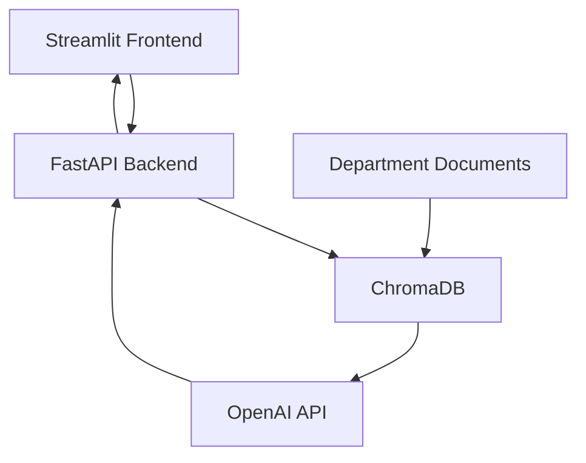

# 🤖 FinSolve Role-Based RAG Chatbot

A secure, production-ready internal AI chatbot powered by **OpenAI + Vector Search (RAG)** — with **role-based access control (RBAC)** for Finance, HR, Engineering, Marketing, Employees, and C-Level Executives.

## 🌐 Live Demo

🔗 Frontend (Streamlit UI):  
https://ja2tbmhz9qqmrjenwwmtts.streamlit.app/

🔗 Backend API (FastAPI Docs):  
https://role-based-aichatbot.onrender.com/docs  

---
## 🖥 Application UI


---

## 🧩 Problem Background

**FinSolve Technologies**, a leading FinTech company, faced:

- Fragmented document access across departments
- Communication delays
- Security risks in sharing internal documents
- No centralized knowledge retrieval system

Teams needed a secure AI assistant that:

- Understands context
- Respects role-based access
- Retrieves department-specific knowledge
- Responds conversationally

---

## 🧠 Solution Overview

This chatbot implements a Retrieval-Augmented Generation (RAG) pipeline with Role-Based Filtering.

## 🔄 How It Works

- User logs in (RBAC enforced)
- User asks a question
- System performs semantic search in ChromaDB
- Only role-permitted documents are retrieved
- Context is sent to OpenAI GPT
- GPT generates a friendly, contextual response

---

## 👥 Role-Based Access Control (RBAC)

| Role               | Permissions                                                                 |
|--------------------|-----------------------------------------------------------------------------|
| C-Level Executives | Full unrestricted access to all documents                                   |
| Finance Team       | Financial reports, expenses, reimbursements                                 |
| Marketing Team     | Campaign performance, customer insights, sales data                         |
| HR Team            | Employee handbook, attendance, leave, payroll                               |
| Engineering Dept.  | System architecture, deployment, CI/CD                                      |
| Employees          | General information (FAQs, company policies, events)                        |

---

## 🚀 Features

### 🔐 Secure Retrieval

- Metadata-based role filtering
- Zero cross-department leakage

### 🔎 Semantic Search

- OpenAI text-embedding-3-small
- Chroma vector database
- Fast similarity matching

### 💬 Conversational AI

- OpenAI gpt-4o-mini
- Context-aware responses
- Friendly, human-like tone

### 🖥 Interactive UI

- Streamlit frontend
- Login panel
- Session-based chat history
- Typing animation
- Feedback buttons (👍👎)


---

## 🛠 Tech Stack

| Layer        | Technology                     |
|-------------|---------------------------------|
| Frontend    | Streamlit                      |
| Backend     | FastAPI                        |
| Embeddings  | OpenAI text-embedding-3-small  |
| LLM         | OpenAI gpt-4o-mini             |
| Vector DB   | ChromaDB                       |
| Deployment  | Render                         |
| Language    | Python 3.11                    |

---

## 🚀 Project Architecture



## 📁 Project Structure

```
role_based_aichatbot-/
├── app/
│   ├── chroma_db/         # Prebuilt vector database
│   ├── embed_documents.py
│   ├── frontend.py
│   └── main.py
│
├── resources/
│   └── data/
│       ├── engineering/
│       ├── finance/
│       ├── general/
│       ├── hr/
│       └── marketing/
│
├── requirements.txt
├── README.md
└── .gitignore
```


## ⚙️ Setup Instructions

### 1. Clone the repository

```bash
git clone https://github.com/gowtham-org/Role_based_aichatbot
cd Role_based_aichatbot-
```

#### 2. 🔧 Backend Setup (FastAPI )

Step into the backend app and create a virtual environment:

```bash
py -3.11 -m venv venv
venv\Scripts\activate
````


Install the dependencies:

```bash
pip install --upgrade pip
pip install -r requirements.txt
```

Create .env:

```bash
OPENAI_API_KEY=your_openai_key
```

Run BAckend

```bash
uvicorn app.main:app --reload
```

### 3. 💬 Frontend Setup (Streamlit UI)
In another new terminal:

```bash
streamlit run app/frontend.py
```
🔗 Visit: http://localhost:8501

### 4. 📄 Embed Documents (Run Once Before Use)
To generate vector embeddings and build the Chroma database:

```bash
python app/embed_documents.py
```

This script:
Loads documents from the resources/data/
Generates embeddings using OpenAI embeddings
Stores them in ChromaDB with role-based metadata

✅ Once these steps are done, your role-based chatbot is fully set up and ready to use! 

---


## 🧪 Sample Users & Roles

| Username | Password     | Role              |
|----------|--------------|-------------------|
| Alice    | ceopass      | c-levelexecutives |
| Bob      | employeepass | employee          |
| Tony     | password123  | engineering       |
| Bruce    | securepass   | marketing         |
| Sam      | financepass  | finance           |
| Natasha  | hrpass123    | hr                |

---

## 🔧 Extending & Customizing

✅ **Add new roles:**  
- Create a new folder in `resources/data/` named after the new department (e.g., `resources/data/legal/`).
- Add your `.md` or `.csv` documents inside that folder.
- Update user `users_db` dictionary in  `app/main.py` to include the new role.
- Rebuild the vector database:
```bash
python app/embed_documents.py
```

✅ **Add new document types:**  
- Extend the file parsing logic inside `app/embed_documents.py` to handle more than `.md` files (like `.pdf`, `.csv`, etc.).

✅ **Change embedding model:**  
- Inside `app/embed_documents.py`, change the line where you set:
  ```python
  EMBEDDING_MODEL = OpenAIEmbeddings(model = "text-embedding-3-small")
  ```
  to any other `text-embedding-3-large"` model.

✅ **Switch LLM:**  
To change the language model used for response generation:

1. Open `app/main.py`
2. Locate the OpenAI model configuration inside the chat completion call:

```python
completion = client.chat.completions.create(
    model="gpt-4o-mini",
    messages=[...],
    temperature=0.7,
)
```


